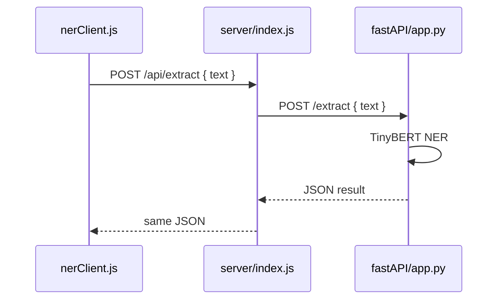

# Wire frontend → Node → FastAPI NER

## Problem

You want this pipeline:



The pieces exist but do not talk yet:

- [nerClient.js](electron_app1/src/utils/nerClient.js) uses `process.env.NER_URL` (does not work in Vite) and hits `/extract` (should hit Node’s `/api/extract`).
- [server/index.js](electron_app1/server/index.js) listens on 3001 but has **no route** and does not forward to Python.
- [app.py](electron_app1/fastAPI/app.py) has broken FastAPI usage (`app.listen`, wrong body type, hardcoded sentence, prints instead of returning JSON).

**Default:** FastAPI stays local (`http://127.0.0.1:8000`). Node is the LAN-facing API (`0.0.0.0:3001`).

## Contract (same JSON at every hop)

Request:

```json
{ "text": "Go to gym at 2pm" }
```

Response (merged NER spans):

```json
{ "event": "gym", "time": "2pm" }
```

(Empty strings when a span is missing.)

## Implementation steps

### 1. Fix FastAPI so it accepts JSON and returns JSON

In [fastAPI/app.py](electron_app1/fastAPI/app.py):

- Remove invalid `app.listen(3002)` (FastAPI is started with **uvicorn**, not `listen`).
- Accept a Pydantic body: `{ "text": str }` (not bare `sentence: str`).
- Use `req.text` instead of the hardcoded sentence.
- After argmax, merge `B-/I-EVENT` and `B-/I-TIME` tokens into `event` / `time` strings.
- `return { "event": ..., "time": ... }`.

Run from `electron_app1/fastAPI`:

```bash
uvicorn app:app --host 127.0.0.1 --port 8000
```

### 2. Add Node proxy route

In [server/index.js](electron_app1/server/index.js):

- `POST /api/extract` reads `req.body.text`.
- `fetch` to `http://127.0.0.1:8000/extract` with the same body.
- Forward status + JSON back to the client.
- Listen on `0.0.0.0:3001` so other devices on the LAN can reach Node.
- Optional: `PYTHON_NER_URL` env override; default `http://127.0.0.1:8000`.

### 3. Point the frontend at Node

In [nerClient.js](electron_app1/src/utils/nerClient.js):

- Use Vite env like the rest of the app (`import.meta.env.VITE_NER_URL`), default `http://localhost:3001`.
- POST to `${base}/api/extract` (Node), not Python’s `/extract`.

Example env (local):

```bash
VITE_NER_URL=http://localhost:3001
```

On another machine on the LAN, set `VITE_NER_URL` to your Mac’s LAN IP, e.g. `http://192.168.x.x:3001`.

### 4. How you run the full stack

Two terminals (plus Vite/Electron as usual):

1. `cd electron_app1/fastAPI && uvicorn app:app --host 127.0.0.1 --port 8000`
2. `cd electron_app1 && npm start` → Node on 3001

Then any caller of `extractEventTime(text)` goes through the chain above.

## Teaching note (why Node sits in the middle)

The browser/Electron UI should only know about Node. Node can reach Python on localhost even when Python is not exposed to the LAN. That keeps the heavy model private and gives you one stable URL for “internal network” clients.